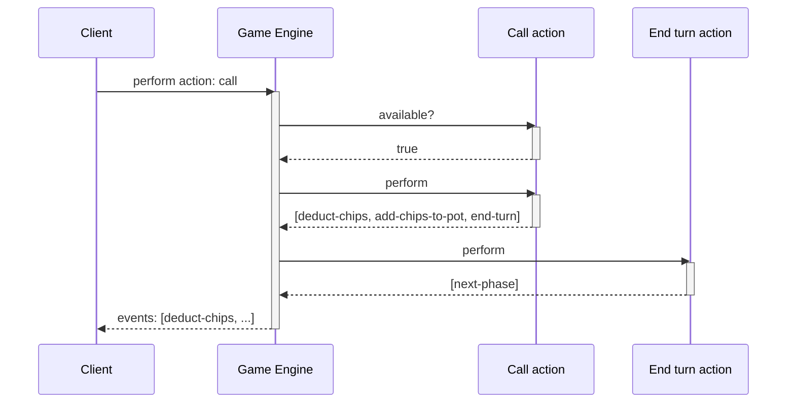

# 'Splendid' board game engine

Splendid is a web-based board game engine written in Javascript.
It features a nodejs backend that handles game logic, and a Svelte-based
frontend that displays the game state and allows players to interact with it.

## Game architecture

Games are split into **phases**, which govern what **actions** players may take.
Actions resolve into **events**, which mutate the game state.

For example, in a game of Poker you might have a phase called `betting`, during
which players have actions available to `call`, `raise`, or `fold`.
If a player chooses to `call`, the action would ensure the player has enough
chips, then resolve into a `deduct-chips` event targeting the player, 
an `add-chips-to-pot` event, and call the `end-turn` action.
The `end-turn` action could then, in turn, work out that all the players have
placed a bet and produce a `next-phase` event to change phase to (e.g.) `river`.

Clients maintain state by applying an ordered list of events on top of an
initial, base state for the game.
This allows clients to replay events, animate individual events, and so on.

Games also supply a **masker**, which can redact events before they're sent
to clients.
This allows secret state (such as the order of the cards in a deck) to be held
on the server.
As actions are only executed on the server, they can rely on this secret state
existing, and use it to generate events that expose the appropriate information
to clients.
For example, in our poker scenario there might be an action to draw a card
from the deck and add it to the community cards; the action can read the next
card in the deck and emit a `deal-card` event containing the card (which is
the first time the card is exposed to clients).

## Project architecture

The project uses a single source root for both the frontend and backend code.
The frontend is a Sveltekit application located under `src/frontend`.
The backend nodejs entrypoint is at `src/index.js`.
The frontend and the backend share a large chunk of code: they both maintain
a game engine, have access to all the game logic, and utility functions.

Communication between the two happens over a websocket connection, implemented
in `src/server` and `src/client`.
The client exposes is state as Svelte stores to enable reacitivity in the UI
components.

## Games

The following games are supported:

### Splendid

A reimplementation of Splendor by Marc André, published by Space Cowboys.
You play as a merchant, buying up developments to gain prestige and attract
noble visitors.
Do you build up a strong foundation to support your future purchases, or do
you rush to buy the most prestigious developments sooner?

The base game is fully implemented, but the graphical frontend is rough and
bare-bones.
No expansions or variants are implemented yet.

## Detailed implementation notes

### Security

To prevent clients from connecting using another player's ID (which is easily
obtainable from the game state), clients generate a public/private keypair when
first connecting to the server.
If a client tries to join a game where a player with the same ID is already
playing, the server will validate that they have access to the same private key.
This is achieved by having clients sign a payload consisting of their socket ID,
game code and current time.
 